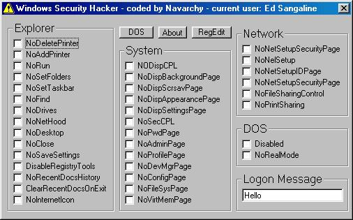



## Windows Security Hacker

### Description

This is a really useful program for both administrators who want to decrease access and users who want to increase it :). If you are a user in a network and can't find, change file access, run, regedit, or a number of other things than this is just what you need. Or if you are an administrator who needs to remove this access you can also use this program. There are also several pointless things you can do like disallowing a user to shut down the computer. If you feel intimidated by the different captions in the SS, don't worry they all have tool tip text that explains them. This code is also heavily commented so download it and check it out. I love votes and comments (also about my new user photo).

Enjoy!
 
### More Info
 

             |
---                |---
**Submitted On**   |2001-05-07 20:19:54
**By**             |[Nave Zeng](https://github.com/Planet-Source-Code/PSCIndex/blob/master/ByAuthor/nave-zeng.md)
**Level**          |Advanced
**User Rating**    |4.1 (37 globes from 9 users)
**Compatibility**  |VB 5\.0, VB 6\.0
**Category**       |[Registry](https://github.com/Planet-Source-Code/PSCIndex/blob/master/ByCategory/registry__1-36.md)
**World**          |[Visual Basic](https://github.com/Planet-Source-Code/PSCIndex/blob/master/ByWorld/visual-basic.md)
**Archive File**   |[Windows Se20777672001\.zip](https://github.com/Planet-Source-Code/nave-zeng-windows-security-hacker__1-23870/archive/master.zip)

